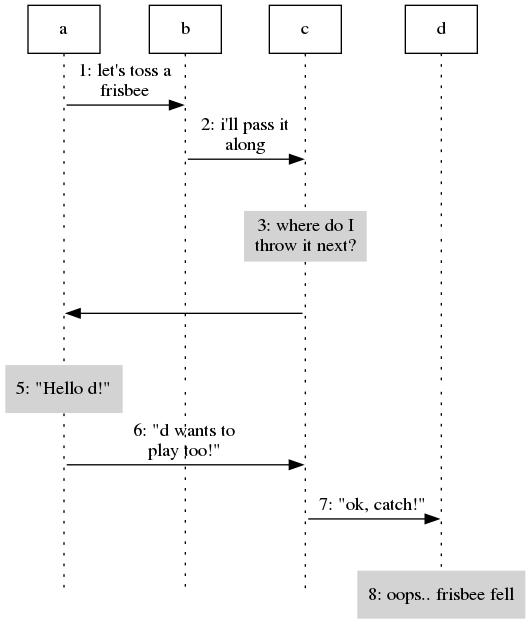

Flow2dot
========
`flow2dot` is a tool to generate nice sequence (flow) diagrams from
textual descriptions, written in Haskell.

Tool itself generates a diagram _description_, which could be fed into [GraphViz](www.graphviz.org)
to get a nice-looking picture.

To try it out, run:
```
  runhaskell flow2dot.hs sample.flow | dot -T png -o sample.png
```
and view "sample.png" with your favorite picture viewer. Make sure 
version of `dot` is at least 2.12.

If you want to tweak the output - read Dot manual
and use it for scaling, colors, pagination etc.

Sample output
============


Acknowledgements
================
Thanks to Cale, quicksilver and roconnor from #haskell for
suggestions on how to modularize this. Thanks to Dema from
haskell@conference.jabber.ru for win32 testing. Gwern0 helped
to adapt this to GHC 6.8.2. Radoslav Dorcik sent in parser improvements.
Mike Shigorin and Denis Smirnov packaged for Alt Linux and provided feedback
on compatibility with different GHC versions. Vasyl Vaskul reported bugs.

Known issues
============

* Dot < 2.12 will most likely segfault on files generated by flow2dot
